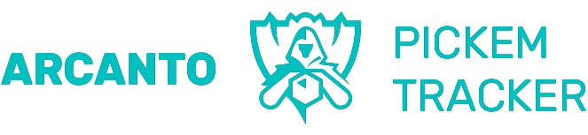

# README - Projeto de Estatísticas do Campeonato Mundial de LoL 2023



## Resultados finais obtidos pelo sistema

Devido ao fim do mundial, desativamos o acesso para evitar consumos de recursos


## Visão Geral

Bem-vindo ao Projeto de Estatísticas do Campeonato Mundial de 2023! Este projeto foi criado para fornecer estatísticas e informações atualizadas sobre o Campeonato Mundial de League of Legends (LoL) de 2023. Como um dos eventos de eSports mais prestigiados do mundo, este torneio reúne as melhores equipes de LoL de todo o mundo para competir pelo título máximo. Este README o guiará pelo projeto, seus objetivos e como usá-lo.

## Objetivos do Projeto

Os principais objetivos deste projeto são os seguintes:

1. **Atualizações de Informações do Bolão:** Nosso sistema buscará e exibirá as estatísticas mais recentes, pontuações e informações relacionadas ao Campeonato Mundial de 2023.

2. **Dados Abrangentes:** Pretendemos fornecer uma ampla gama de dados, incluindo estatísticas de equipes, desempenho de jogadores, resultados de partidas e classificação na fase de grupos.

3. **Interface Amigável para o Usuário:** O projeto contará com uma interface web amigável para facilitar a navegação e o acesso a todas as informações.

## Começando

### Pré-requisitos

Antes de usar este projeto, certifique-se de ter os seguintes softwares e ferramentas instalados:

- Node.js
- NPM (Gerenciador de Pacotes do Node)
- Git

### Instalação

1. Clone o repositório em sua máquina local:

   ```bash
   git clone https://github.com/imfarias/pickem-tracker.git
   ```

2. Navegue até o diretório do projeto:

   ```bash
   cd pickem-tracker
   ```

3. Instale as dependências necessárias:

   ```bash
   npm install
   ```

### Executando o Projeto

Para iniciar o projeto, siga estas etapas:

1. Inicie o servidor:

   ```bash
   npm run dev
   ```

2. Abra seu navegador da web e acesse `http://localhost:3000` para acessar a interface web do projeto.

## Estrutura do Projeto

O projeto tem uma estrutura simples que inclui os seguintes diretórios e arquivos principais:

- `src/`: Contém o código-fonte do projeto.
- `public/`: Inclui ativos estáticos, como imagens e estilos.
- `src/api`: Contém as chamadas da API
- `package.json` e `package-lock.json`: Definem as dependências e metadados do projeto.

## Contribuições

Aceitamos contribuições da comunidade para melhorar e expandir este projeto. Se deseja contribuir, siga estas etapas:

1. Faça um fork do repositório no GitHub.

2. Faça suas alterações e aprimoramentos.

3. Envie uma solicitação pull com uma descrição detalhada de suas alterações.

## Licença

Este projeto está licenciado sob a Licença MIT - consulte o arquivo [LICENSE](LICENSE) para obter detalhes.

## Contato

Se tiver alguma dúvida ou precisar de assistência com este projeto, sinta-se à vontade para nos contatar em [arcantosmurf@gmail.com](mailto:arcantosmurf@gmail.com).

Aproveite o uso do Projeto de Estatísticas do Campeonato Mundial de 2023 e mantenha-se atualizado sobre toda a ação emocionante que acontecerá no Worlds 2023!

**Aviso:** Este projeto não é afiliado a nem endossado pela Riot Games ou pelo Campeonato Mundial de League of Legends. É um projeto independente criado para fins informativos e educacionais. Todo o conteúdo relacionado ao League of Legends e logotipos são propriedade da Riot Games.
